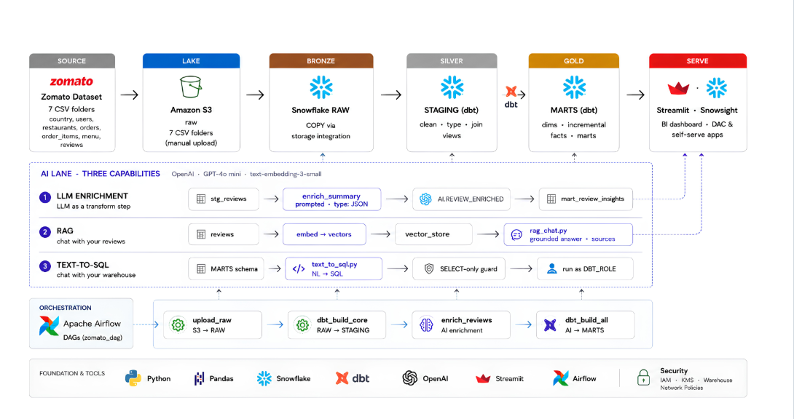
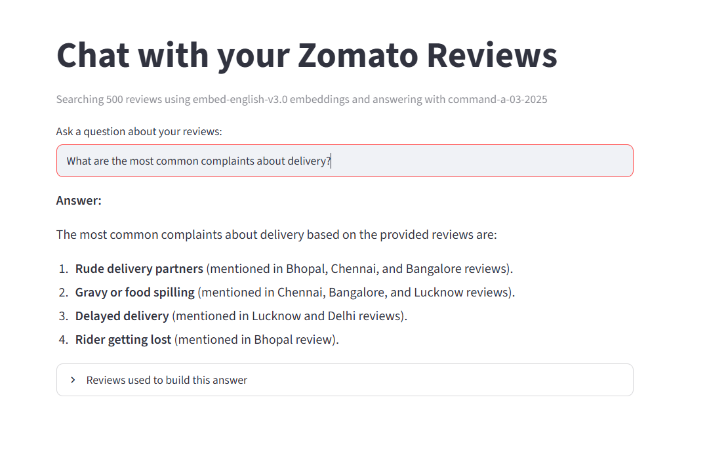
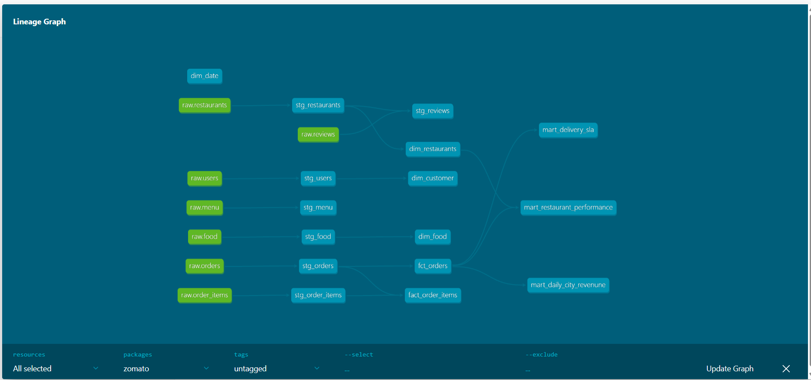
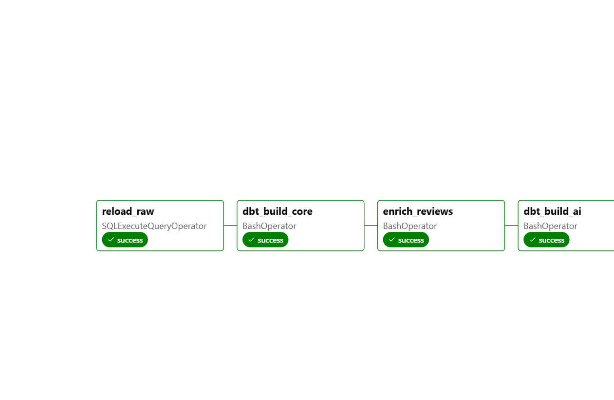

# Fork AI

### Natural Language Analytics, Powered by AI

An end-to-end data engineering and AI analytics platform that transforms natural-language questions into validated SQL and delivers reliable, business-ready insights from food delivery application data.

**[🚀 Live Demo](https://fork-ai.streamlit.app/)**

> **Ask questions. Get validated insights from your data.**

---

## Overview

Fork AI provides a natural-language interface for exploring food delivery application data. Instead of manually writing SQL, users can ask analytical questions in plain English and receive data-driven answers.

Behind the application, the platform combines a cloud data pipeline, Snowflake data warehouse, dbt transformations, Airflow orchestration, and AI-powered capabilities including Text-to-SQL, RAG, and LLM-based review enrichment.

The system is designed around a key principle: **generating SQL is not enough — the query and its results need to be validated before an answer is returned.**

---

## Dataset

The project uses a synthetic food delivery application dataset containing **13M+ rows across 7 source tables**:

* Customers
* Restaurants
* Food
* Menu
* Orders
* Order Items
* Reviews

The data is transformed into analytical models in Snowflake using dbt and serves as the foundation for the platform's AI-driven analytics.

---

## Architecture

Fork AI follows a layered data engineering architecture that moves data from raw ingestion through transformation and analytical serving, with AI capabilities built on top of the warehouse.



**Pipeline:**
**Source → Amazon S3 → Snowflake Bronze → dbt Silver → Snowflake Gold → Streamlit**

The platform integrates three AI workflows across the analytical layer:

* **LLM Enrichment** — enriches review data with structured AI-generated insights.
* **RAG** — retrieves relevant review context to generate grounded responses.
* **Text-to-SQL** — converts natural-language questions into SQL for analytical querying.

---

## AI Capabilities

Fork AI combines three AI workflows to support different analytical use cases:

### 1. LLM Review Enrichment

Review data is enriched using an LLM to extract structured insights from unstructured customer reviews. The enriched data is persisted in Snowflake and incorporated into downstream analytical models.

### 2. Retrieval-Augmented Generation (RAG)

The RAG pipeline uses review embeddings to retrieve relevant context before generating an answer. This allows responses to be grounded in the underlying review data rather than relying solely on the LLM's general knowledge.



### 3. Text-to-SQL

Users can ask questions about the analytical data in natural language. Fork AI generates SQL based on the available schema, validates the query, executes it against Snowflake, and returns the result in a business-friendly format.

---

## NL2SQL Reliability & Guardrails

Fork AI treats Text-to-SQL as a multi-stage validation problem rather than a single LLM call.

```text
Natural Language
      ↓
SQL Generation
      ↓
SQL Validation
      ↓
SQL Execution
      ↓
Result Validation
      ↓
Answer Formatting
```

The validation layer is designed to handle common NL2SQL failure modes, including:

* **Aggregation mismatches** — distinguishing totals, averages, counts, and row-level results.
* **Ranking queries** — validating ordering and top/bottom results.
* **Percentage calculations** — ensuring percentage questions return percentages rather than raw counts.
* **Unknown entities** — handling locations, restaurants, or other entities that are not present in the data.
* **Missing dates** — handling questions where required temporal information is absent or ambiguous.
* **Grain mismatches** — ensuring the query operates at the correct level of detail.
* **Empty or unexpected results** — validating execution output before generating the final response.

This approach separates **SQL correctness** from **answer correctness**, improving the reliability of the overall analytics workflow.

---

## Data Engineering

The platform uses a layered ELT architecture with **Amazon S3, Snowflake, dbt, and Apache Airflow**. Raw food delivery data is ingested into the warehouse, transformed through staging and analytical models, and served to the AI and analytics layers.

---

### dbt Lineage

dbt manages dependencies across staging models, dimensions, facts, and business-facing marts.

---

### Airflow Orchestration

Apache Airflow orchestrates the pipeline, including raw data loading, dbt transformations, and AI enrichment.


